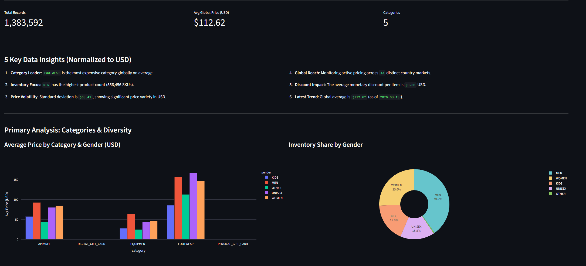
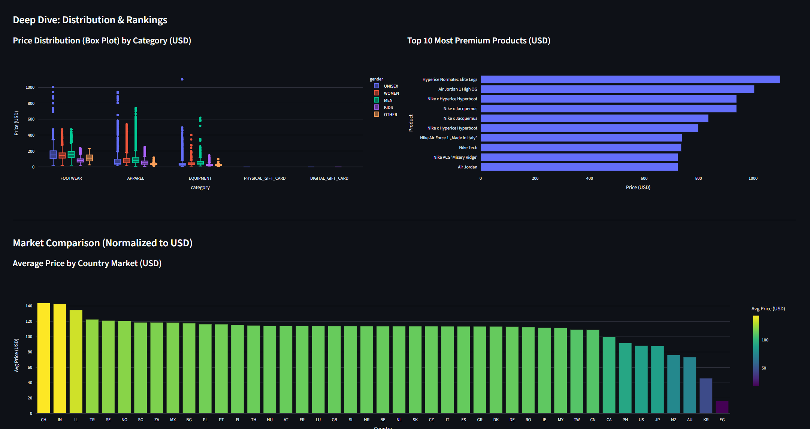

# Nike Price Monitor: Analytical Dashboard

This module provides a real-time, interactive dashboard built with **Streamlit** to visualize the global pricing data processed by the dbt pipeline.

## 1. Key Analytics

The dashboard is designed to provide high-impact business insights:

* **Categories & Diversity**: Average price breakdown by category and SKU distribution by gender (Donut Chart).
* **Price Spread (Statistical)**: Box plots showing price variance and identifying outliers globally.
* **Premium Ranking**: Top 10 most expensive products in the current inventory.
* **Global Benchmarking**: Direct country-to-country comparison normalized to USD.

## 2. Dashboard Screenshots

### Overview & Inventory Share



### Distribution & Market Comparison



## 3. How to Run Locally

1. Ensure the infrastructure is running:

   ```bash
   cd 1_infrastructure
   docker compose up -d
   ```

2. Access the dashboard at: [http://localhost:8501](http://localhost:8501)

> [!TIP]
> Use the sidebar filters to drill down into specific Categories or Gender segments. The insights at the top update automatically based on your selection.
